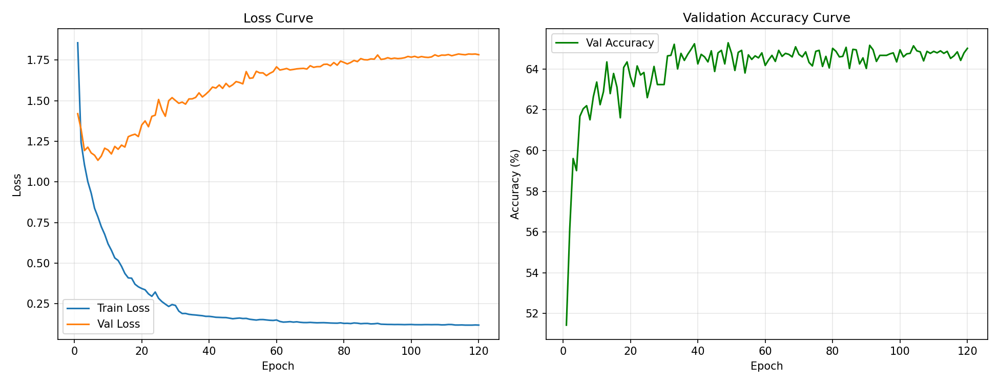
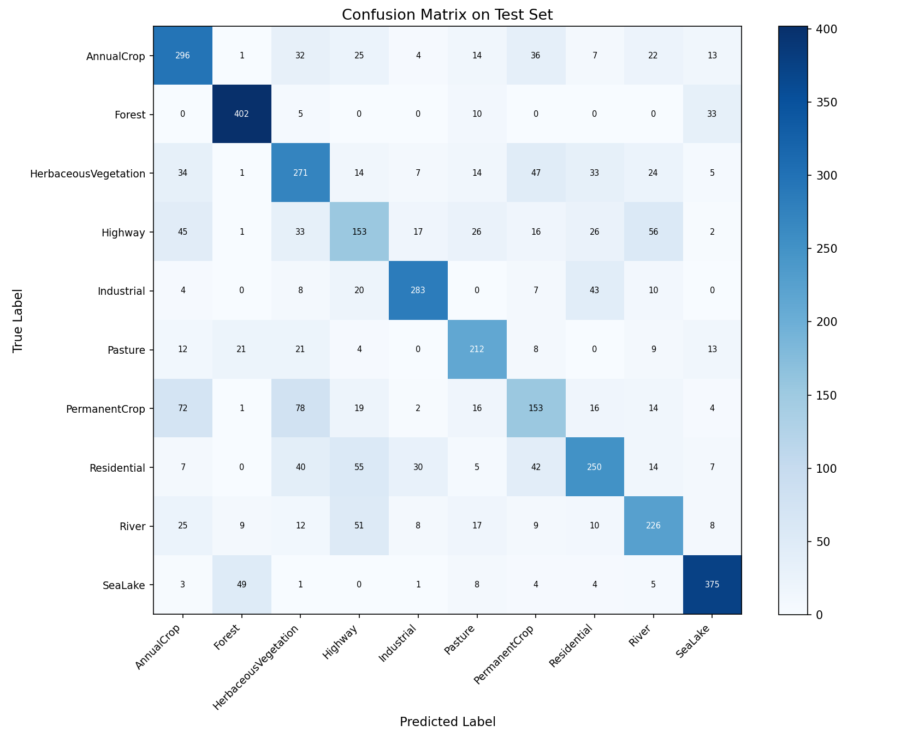
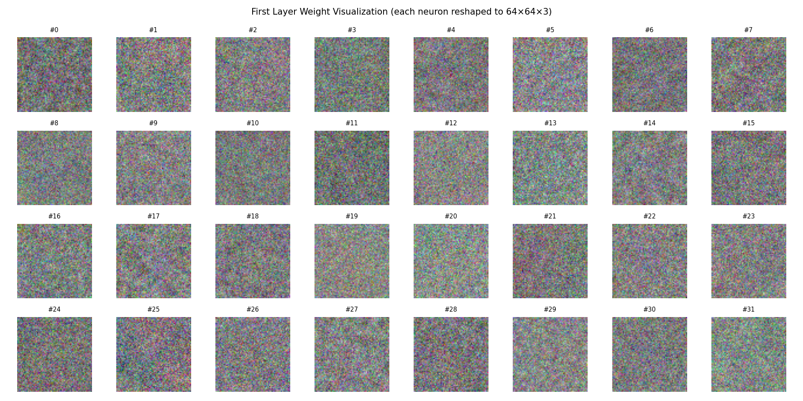
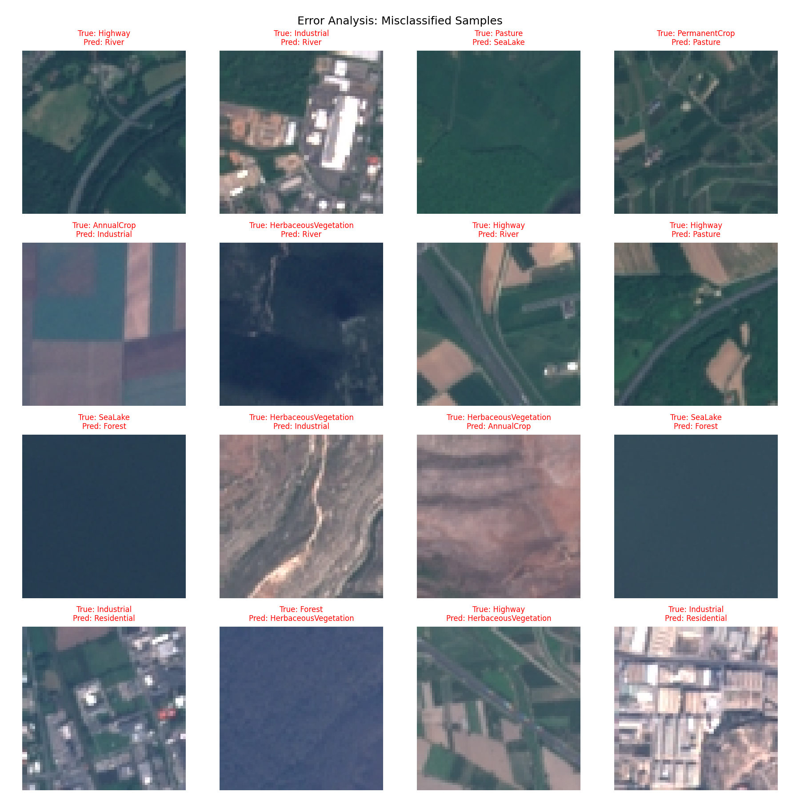

# HW1 实验报告：从零构建三层 MLP 实现卫星图像分类

---

## 1. 任务概述

本次作业要求在不使用任何深度学习框架（PyTorch、TensorFlow、JAX 等）的前提下，完全手工实现一个三层多层感知机（MLP），并在 EuroSAT 遥感图像数据集上完成 10 分类任务。

**数据集**：EuroSAT_RGB，共 27,000 张 64×64 RGB 卫星图像，均匀分布于 10 个土地覆盖类别：

| 类别 | 中文名 | 样本数 |
|------|--------|--------|
| AnnualCrop | 一年生农作物 | 3000 |
| Forest | 森林 | 3000 |
| HerbaceousVegetation | 草本植被 | 3000 |
| Highway | 公路 | 2500 |
| Industrial | 工业区 | 2500 |
| Pasture | 牧场 | 2000 |
| PermanentCrop | 多年生农作物 | 2500 |
| Residential | 住宅区 | 3000 |
| River | 河流 | 2500 |
| SeaLake | 海洋/湖泊 | 3000 |

---

## 2. 数据处理

### 2.1 数据集划分

采用**分层抽样（Stratified Sampling）**，按 70% / 15% / 15% 的比例将数据集划分为训练集、验证集和测试集，确保各类别在三个子集中的分布比例一致。

| 子集 | 样本数 |
|------|--------|
| 训练集 | 18,900 |
| 验证集 | 4,050 |
| 测试集 | 4,050 |

### 2.2 图像预处理

1. **展平**：将每张 64×64×3 的 RGB 图像展平为长度为 12,288 的一维向量（像素值先归一化到 [0,1]）。
2. **标准化（Z-score）**：以训练集的像素均值和标准差对所有数据做标准化，使输入分布均值接近 0、标准差接近 1，有助于加速收敛。

```
X_normalized = (X - mean_train) / (std_train + 1e-8)
```

均值和标准差保存为 `norm_mean.npy` / `norm_std.npy`，以便测试时复用。

---

## 3. 模型结构

### 3.1 网络架构

采用三层全连接神经网络（MLP），架构如下：

```
输入层    (12288 维)
    ↓   W1(12288×512) + b1
隐藏层1   (512 维)  → ReLU 激活
    ↓   W2(512×128)  + b2
隐藏层2   (128 维)  → ReLU 激活
    ↓   W3(128×10)   + b3
输出层    (10 维)   → Softmax
```

最终输出为 10 维概率向量，取最大概率对应类别作为预测结果。

### 3.2 参数初始化

采用 **He 初始化**（针对 ReLU 激活函数推荐），避免梯度消失/爆炸：

```
W ~ N(0, sqrt(2 / fan_in))
b = 0
```

### 3.3 支持的激活函数

| 激活函数 | 前向 | 反向（导数） |
|----------|------|-------------|
| ReLU | `max(0, z)` | `1 if z > 0 else 0` |
| Sigmoid | `1 / (1 + exp(-z))` | `σ(z) · (1 - σ(z))` |
| Tanh | `tanh(z)` | `1 - tanh²(z)` |

---

## 4. 手工实现自动微分与反向传播

### 4.1 损失函数

使用**交叉熵损失（Cross-Entropy Loss）** + **L2 正则化（Weight Decay）**：

```
L = CE_Loss + λ/2 · (||W1||² + ||W2||² + ||W3||²)
CE_Loss = -1/N · Σ log(p[i, y[i]])
```

其中 `p` 为 Softmax 输出，`λ` 为正则化系数（weight_decay）。

### 4.2 反向传播推导

Softmax + Cross-Entropy 联合梯度（数值稳定，避免中间项抵消）：

```
∂L/∂z3 = (p - one_hot(y)) / N          # (N, 10)
```

随后按链式法则逐层反传：

```
dW3 = a2.T @ dz3 + λ·W3
db3 = sum(dz3, axis=0)
da2 = dz3 @ W3.T
dz2 = da2 * act'(z2)                   # 过激活函数导数
dW2 = a1.T @ dz2 + λ·W2
...（以此类推到第一层）
```

整个过程**仅使用 NumPy 矩阵运算**，不依赖任何自动微分框架。

---

## 5. 训练设置

### 5.1 优化器

采用 **带动量的 SGD（SGD with Momentum）**：

```
v = momentum · v - lr · ∇W
W = W + v
```

动量系数 `momentum = 0.9`，有效加速收敛并抑制震荡。

### 5.2 学习率衰减（Learning Rate Decay）

使用 **Step Decay** 策略：每隔固定步数将学习率乘以衰减因子：

```
lr(epoch) = lr_init × decay_rate ^ (epoch // decay_step)
```

最终训练配置：`lr_init=0.005, decay_rate=0.5, decay_step=30`

学习率变化：0.005 → 0.0025（Epoch 30）→ 0.00125（Epoch 60）→ 0.000625（Epoch 90）

### 5.3 完整训练超参数

| 超参数 | 值 |
|--------|-----|
| 隐藏层1大小 (H1) | 512 |
| 隐藏层2大小 (H2) | 128 |
| 激活函数 | ReLU |
| L2 正则化系数 (λ) | 1e-4 |
| 初始学习率 | 5e-3 |
| 学习率衰减率 | 0.5 |
| 学习率衰减步长 | 30 epochs |
| 动量系数 | 0.9 |
| Batch Size | 256 |
| 训练轮数 (Epochs) | 120 |

---

## 6. 超参数搜索

### 6.1 搜索方法

采用**网格搜索（Grid Search）**，对以下超参数进行组合枚举：

| 超参数 | 搜索范围 |
|--------|----------|
| 初始学习率 | {0.01, 0.005} |
| 隐藏层1大小 | {512, 256} |
| 隐藏层2大小 | {256, 128} |
| L2 正则化系数 | {1e-3, 1e-4} |
| 激活函数 | {relu} |

共 **16 组超参数组合**，每组训练 30 个 epoch，以验证集最优准确率为评价指标。

### 6.2 搜索结果（Top 5）

| 排名 | lr | H1 | H2 | wd | Val Acc |
|------|----|----|----|----|---------|
| 1 | 0.005 | 512 | 128 | 1e-4 | **65.01%** |
| 2 | 0.005 | 512 | 256 | 1e-4 | 64.91% |
| 3 | 0.005 | 512 | 128 | 1e-3 | 64.69% |
| 4 | 0.005 | 512 | 256 | 1e-3 | 64.44% |
| 5 | 0.010 | 512 | 256 | 1e-4 | 64.32% |

**关键观察**：
- **较大的隐藏层（H1=512）** 始终优于 H1=256，说明模型容量对该任务影响显著
- **较小的学习率（lr=0.005）** 整体优于 lr=0.01，避免了训练初期的震荡
- **较小的 L2 正则化（wd=1e-4）** 轻微优于 wd=1e-3，说明模型欠拟合倾向更强，不宜过重的正则化
- H2=128 与 H2=256 差异不大（<0.2%），说明瓶颈主要在第一层

---

## 7. 训练过程可视化

### 7.1 Loss 曲线与 Accuracy 曲线



**观察与分析**：

- **训练 Loss（蓝线）**：从初始约 1.86 快速下降，在 60 epoch 后趋于平稳，最终降至约 0.12，说明模型在训练集上已充分拟合。
- **验证 Loss（橙线）**：在前 10 个 epoch 快速下降至约 1.2，但随后缓慢上升至约 1.78，呈现典型的**过拟合趋势**——训练集 Loss 持续下降而验证集 Loss 反向上升。
- **验证 Accuracy（绿线）**：在第 5 epoch 附近快速上升至约 62%，随后缓慢爬升至 65% 左右并趋于饱和，最高达 **65.28%**（由 early stopping 机制保存了对应权重）。
- Loss 曲线中验证集的震荡现象，主要来源于 mini-batch SGD 的随机性以及学习率在衰减节点处的阶跃变化。

### 7.2 过拟合分析

从曲线可明显观察到训练集与验证集之间存在显著的 Loss 差距（训练 0.12 vs 验证 1.78），说明三层 MLP 将高维图像展平后丢失了空间结构信息，泛化能力受限。这是 MLP 相比 CNN 在图像任务上的固有局限。

---

## 8. 测试集评估结果

### 8.1 整体准确率

> **测试集准确率：64.72%**
> （最优验证集准确率：65.28%，对应 epoch 约在第 80 轮附近）

### 8.2 各类别准确率

| 类别 | 准确率 | 正确/总数 |
|------|--------|----------|
| Forest（森林） | **89.3%** | 402/450 |
| SeaLake（海洋/湖泊） | **83.3%** | 375/450 |
| Industrial（工业区） | 75.5% | 283/375 |
| Pasture（牧场） | 70.7% | 212/300 |
| AnnualCrop（一年生农作物） | 65.8% | 296/450 |
| HerbaceousVegetation（草本植被） | 60.2% | 271/450 |
| River（河流） | 60.3% | 226/375 |
| Residential（住宅区） | 55.6% | 250/450 |
| Highway（公路） | **40.8%** | 153/375 |
| PermanentCrop（多年生农作物） | **40.8%** | 153/375 |

**规律**：视觉特征**独特**（大面积蓝色水体、深绿色密林）的类别准确率高；视觉上**相互混淆**的类别（Highway/River 均为细长线状，Annual/Permanent Crop 色调相近）准确率低。

### 8.3 混淆矩阵



**主要混淆对分析**：

| 真实类别 | 主要被预测为 | 混淆数 | 原因分析 |
|----------|------------|--------|----------|
| Highway（公路） | River（河流） | 56 | 两者均为细长线性结构，色调相近（灰/蓝） |
| PermanentCrop | AnnualCrop | 72 | 两类农作物纹理和色彩高度相似 |
| PermanentCrop | HerbaceousVegetation | 78 | 多年生作物绿色植被覆盖与草本植被相似 |
| Residential（住宅区） | Highway（公路） | 55 | 住宅区内含道路，局部纹理与公路相似 |
| Forest（森林） | SeaLake（海洋/湖泊） | 33 | 深色区域（深海/密林）视觉相似 |

---

## 9. 权重可视化与空间模式分析

### 9.1 第一层权重可视化



将第一层权重矩阵 W1（形状 12288×512）的每一列 reshape 为 64×64×3 并作为图像显示，展示了各神经元所"关注"的视觉模式。

### 9.2 分析

从可视化结果来看，第一层权重呈现出**高度随机噪声**的纹理模式，各神经元并未形成像 CNN 第一层那样清晰可辨的空间滤波器（如边缘、颜色斑块等）。

**原因分析**：
1. **全连接结构的局限性**：MLP 在训练中每个神经元需要同时响应输入的所有 12,288 个像素，难以学到局部化的空间特征；相比之下，CNN 的权重共享机制天然诱导学到局部空间滤波器。
2. **高维稀疏输入**：12,288 维输入对于 512 维隐藏层来说维度极高，大量权重对应的像素组合在训练数据中可能从未同时出现，导致权重难以收敛到有意义的模式。
3. **无空间归纳偏置**：MLP 将图像展平处理，完全破坏了像素间的空间邻近关系，使得网络无法像 CNN 那样利用局部相关性。

尽管如此，仍可观察到少数权重图像中存在隐约的**色调倾向**（部分偏绿/偏蓝），推测可能对应了对植被或水体类别有区分作用的特征，但整体上难以做出明确的语义解释。

---

## 10. 错例分析（Error Analysis）

### 10.1 错误样本展示



测试集中共有 **1,429 个错误样本**（共 4,050 个），错误率约 35.28%。

### 10.2 典型错误类型分析

**① Highway（公路）→ River（河流）**（56例）

从错例图可见，部分高速公路图像具有反光路面，在卫星图像中呈现出与河流相似的灰蓝色细长带状结构。MLP 在丢失空间结构信息后，仅凭像素强度统计难以区分这两种线性地物。

**② PermanentCrop（多年生农作物）→ AnnualCrop / HerbaceousVegetation**（分别 72、78 例）

两类农作物在色调（绿色调）和纹理（周期性行列结构）上极为相似，差异主要体现在细节纹理（如树冠形状、叶片大小），而展平操作完全破坏了这些空间细节，导致模型难以区分。

**③ Industrial（工业区）→ Residential（住宅区）**（43例）

工业区和住宅区均包含规整的建筑物和道路，在像素级统计特征上较为接近。工业区的大型厂房与住宅楼在俯视图中的形态差异依赖精细的空间纹理，MLP 难以捕捉。

**④ SeaLake（海洋/湖泊）→ Forest（森林）**（49例）

深色的湖泊/海洋与浓密的深色森林在颜色强度上极为相近，均呈现大面积深色区域。MLP 主要依赖颜色统计特征分类，对于这类"颜色相近但场景完全不同"的情况束手无策。

**⑤ Pasture（牧场）→ Forest（森林）**（21例）

牧场中若草木茂密，则绿色覆盖率与森林相近，二者颜色直方图高度重叠。

### 10.3 总结

主要错误根源在于：MLP 处理图像时将像素展平，**丢失了空间结构信息**，只能依赖全局像素统计（颜色分布、亮度均值等）进行分类，对于依赖局部纹理、边缘、形状等高阶空间特征的区分任务力不从心。引入 CNN 可显著改善这一问题。

---

## 11. 代码结构说明

```
project/
├── data_loader.py      # 数据加载、数据集划分、Z-score 标准化
├── model.py            # 三层 MLP：前向传播 + 手写反向传播
├── trainer.py          # SGD 优化器（带动量）、学习率衰减、训练循环
├── hp_search.py        # 网格搜索 / 随机搜索超参数模块
├── evaluator.py        # 测试集评估、准确率、混淆矩阵
├── visualizer.py       # 训练曲线、权重可视化、错例分析图
├── train.py            # 主训练脚本（一键运行完整流程）
├── test.py             # 独立测试脚本（加载已保存权重进行评估）
└── outputs/
    ├── best_model.npz          # 最优模型权重
    ├── norm_mean.npy           # 训练集均值（用于标准化）
    ├── norm_std.npy            # 训练集标准差
    ├── training_curves.png     # 训练曲线图
    ├── confusion_matrix.png    # 混淆矩阵热图
    ├── weights_visualization.png   # 第一层权重可视化
    ├── error_analysis.png      # 错例分析图
    └── hp_search_results.json  # 超参数搜索结果
```

---

## 12. 环境依赖

```
Python   >= 3.8
numpy    >= 1.24
Pillow   >= 9.0
matplotlib >= 3.5
```

**运行方式**：

```bash
# 训练（包含超参数搜索 + 完整训练 + 所有可视化）
cd project/
python train.py

# 独立测试（加载已保存权重）
python test.py
```

---

## 13. 结论与展望

本次实验在不使用任何深度学习框架的条件下，完整实现了一个三层 MLP 分类器，在 EuroSAT 数据集上取得了 **64.72% 的测试集准确率**。

**主要收获**：
- 深刻理解了前向传播、反向传播（链式法则）的矩阵计算细节
- 掌握了 SGD + 动量、学习率衰减、L2 正则化等经典训练技巧
- 通过超参数搜索验证了各超参数对模型性能的影响规律
- 通过混淆矩阵和错例分析，直观理解了 MLP 在图像任务上的固有局限

**性能瓶颈与改进方向**：
- 当前 MLP 准确率约 65%，主要受限于将图像展平破坏了空间结构信息
- 引入 CNN（局部感受野 + 权重共享）可将同数据集准确率提升至 95%+
- 数据增强（翻转、旋转、色彩抖动）可进一步提升泛化能力

---

*实验报告 | EuroSAT 遥感图像分类 | HW1*
