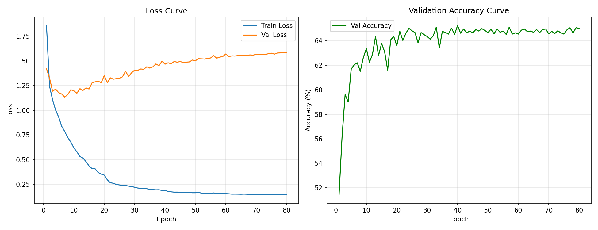
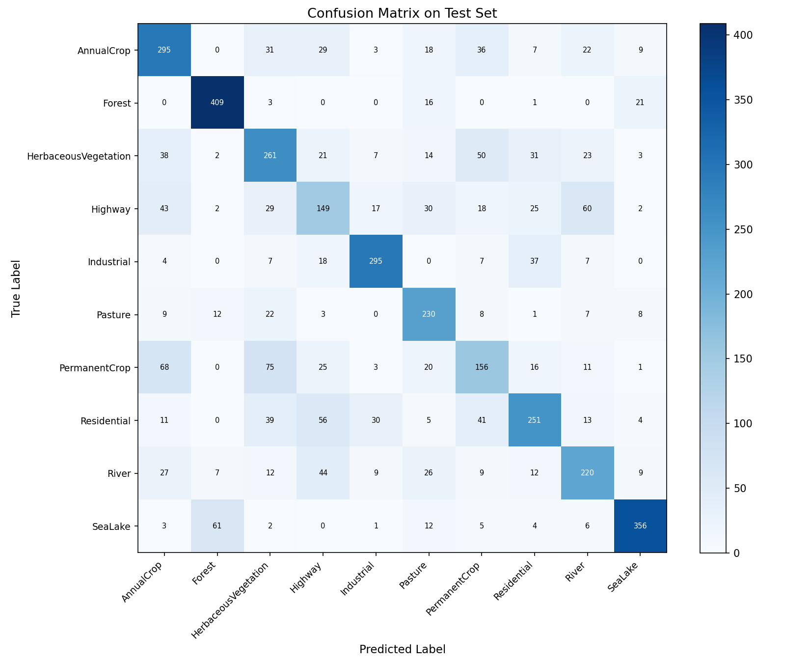
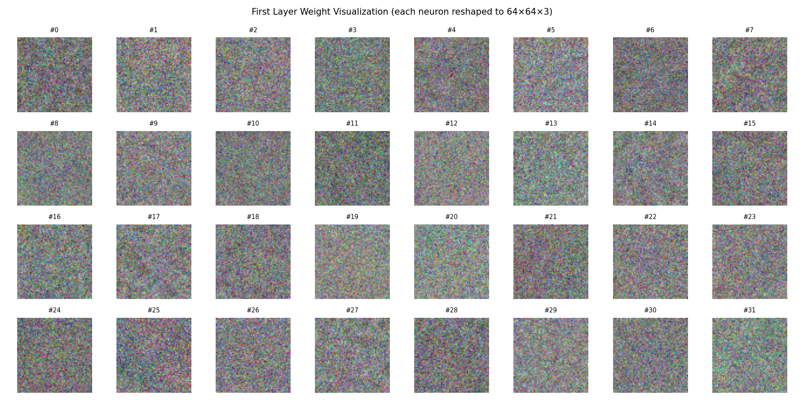
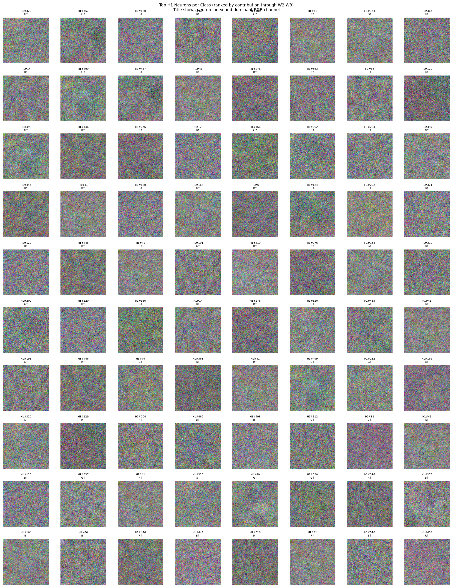
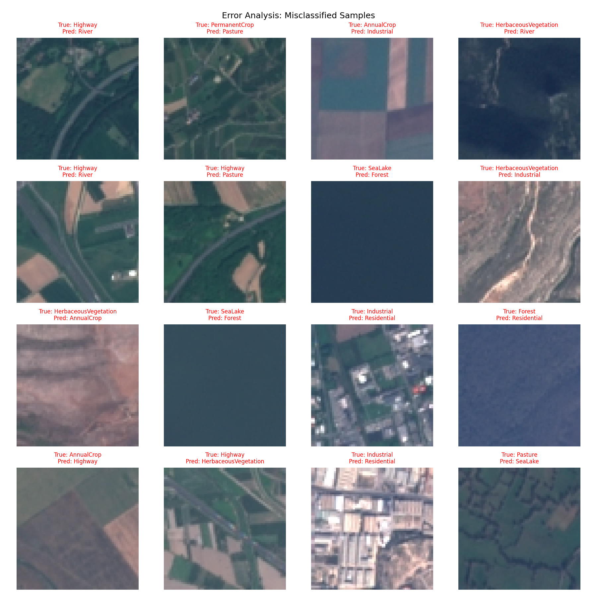

# HW1 实验报告：从零构建三层 MLP 实现卫星图像分类

| | |
|---|---|
| **姓名** | 易晨 |
| **学号** | 25210980127 |
| **GitHub** | [https://github.com/Hi-AYou/kjzn_hw1](https://github.com/Hi-AYou/kjzn_hw1) |
| **模型权重** | [Google Drive（best_model.npz）](https://drive.google.com/drive/folders/1OHgKIYI8lV6QxD7adL9WdBczMfKI1RDX?usp=sharing) |

---

## 1. 任务概述

本次作业要求在不使用任何深度学习框架（PyTorch、TensorFlow、JAX 等）的前提下，完全手工实现一个三层多层感知机（MLP），并在 EuroSAT 遥感图像数据集上完成 10 分类任务。

**数据集**：EuroSAT_RGB，共 27,000 张 64×64 RGB 卫星图像，均匀分布于 10 个土地覆盖类别：

| 类别 | 中文名 | 样本数 |
|------|--------|--------|
| AnnualCrop | 一年生农作物 | 3000 |
| Forest | 森林 | 3000 |
| HerbaceousVegetation | 草本植被 | 3000 |
| Highway | 公路 | 2500 |
| Industrial | 工业区 | 2500 |
| Pasture | 牧场 | 2000 |
| PermanentCrop | 多年生农作物 | 2500 |
| Residential | 住宅区 | 3000 |
| River | 河流 | 2500 |
| SeaLake | 海洋/湖泊 | 3000 |

---

## 2. 数据处理

### 2.1 数据集划分

采用**分层抽样（Stratified Sampling）**，按 70% / 15% / 15% 的比例将数据集划分为训练集、验证集和测试集，确保各类别在三个子集中的分布比例一致。

| 子集 | 样本数 |
|------|--------|
| 训练集 | 18,900 |
| 验证集 | 4,050 |
| 测试集 | 4,050 |

### 2.2 图像预处理

1. **展平**：将每张 64×64×3 的 RGB 图像展平为长度为 12,288 的一维向量（像素值先归一化到 [0,1]）。
2. **标准化（Z-score）**：以训练集的像素均值和标准差对所有数据做标准化，使输入分布均值接近 0、标准差接近 1，有助于加速收敛。

```
X_normalized = (X - mean_train) / (std_train + 1e-8)
```

均值和标准差保存为 `norm_mean.npy` / `norm_std.npy`，以便测试时复用。

---

## 3. 模型结构

### 3.1 网络架构

采用三层全连接神经网络（MLP），架构如下：

```
输入层    (12288 维)
    ↓   W1(12288×512) + b1
隐藏层1   (512 维)  → ReLU 激活
    ↓   W2(512×128)  + b2
隐藏层2   (128 维)  → ReLU 激活
    ↓   W3(128×10)   + b3
输出层    (10 维)   → Softmax
```

最终输出为 10 维概率向量，取最大概率对应类别作为预测结果。

### 3.2 参数初始化

采用 **He 初始化**（针对 ReLU 激活函数推荐），避免梯度消失/爆炸：

```
W ~ N(0, sqrt(2 / fan_in))
b = 0
```

### 3.3 支持的激活函数

| 激活函数 | 前向 | 反向（导数） |
|----------|------|-------------|
| ReLU | `max(0, z)` | `1 if z > 0 else 0` |
| Sigmoid | `1 / (1 + exp(-z))` | `σ(z) · (1 - σ(z))` |
| Tanh | `tanh(z)` | `1 - tanh²(z)` |

---

## 4. 手工实现自动微分与反向传播

### 4.1 损失函数

使用**交叉熵损失（Cross-Entropy Loss）** + **L2 正则化（Weight Decay）**：

```
L = CE_Loss + λ/2 · (||W1||² + ||W2||² + ||W3||²)
CE_Loss = -1/N · Σ log(p[i, y[i]])
```

其中 `p` 为 Softmax 输出，`λ` 为正则化系数（weight_decay）。

### 4.2 反向传播推导

Softmax + Cross-Entropy 联合梯度（数值稳定，避免中间项抵消）：

```
∂L/∂z3 = (p - one_hot(y)) / N          # (N, 10)
```

随后按链式法则逐层反传：

```
dW3 = a2.T @ dz3 + λ·W3
db3 = sum(dz3, axis=0)
da2 = dz3 @ W3.T
dz2 = da2 * act'(z2)                   # 过激活函数导数
dW2 = a1.T @ dz2 + λ·W2
...（以此类推到第一层）
```

整个过程**仅使用 NumPy 矩阵运算**，不依赖任何自动微分框架。

---

## 5. 训练设置

### 5.1 优化器

采用 **带动量的 SGD（SGD with Momentum）**：

```
v = momentum · v - lr · ∇W
W = W + v
```

动量系数 `momentum = 0.9`，有效加速收敛并抑制震荡。

### 5.2 学习率衰减（Learning Rate Decay）

使用 **Step Decay** 策略：每隔固定步数将学习率乘以衰减因子：

```
lr(epoch) = lr_init × decay_rate ^ (epoch // decay_step)
```

最终训练配置：`lr_init=0.005, decay_rate=0.5, decay_step=20`

学习率变化：0.005 → 0.0025（Epoch 20）→ 0.00125（Epoch 40）→ 0.000625（Epoch 60）

### 5.3 完整训练超参数

| 超参数 | 值 |
|--------|-----|
| 隐藏层1大小 (H1) | 512 |
| 隐藏层2大小 (H2) | 128 |
| 激活函数 | ReLU |
| L2 正则化系数 (λ) | 1e-4 |
| 初始学习率 | 5e-3 |
| 学习率衰减率 | 0.5 |
| 学习率衰减步长 | 20 epochs |
| 动量系数 | 0.9 |
| Batch Size | 256 |
| 训练轮数 (Epochs) | 80 |

---

## 6. 超参数搜索

### 6.1 搜索方法

采用**网格搜索（Grid Search）**，对以下超参数进行组合枚举：

| 超参数 | 搜索范围 |
|--------|----------|
| 初始学习率 | {0.01, 0.005} |
| 隐藏层1大小 | {512, 256} |
| 隐藏层2大小 | {256, 128} |
| L2 正则化系数 | {1e-3, 1e-4} |
| 激活函数 | {relu} |

共 **16 组超参数组合**，每组训练 30 个 epoch，以验证集最优准确率为评价指标。

### 6.2 搜索结果（Top 5）

| 排名 | lr | H1 | H2 | wd | Val Acc |
|------|----|----|----|----|---------|
| 1 | 0.005 | 512 | 128 | 1e-4 | **65.01%** |
| 2 | 0.005 | 512 | 256 | 1e-4 | 64.91% |
| 3 | 0.005 | 512 | 128 | 1e-3 | 64.69% |
| 4 | 0.005 | 512 | 256 | 1e-3 | 64.44% |
| 5 | 0.010 | 512 | 256 | 1e-4 | 64.32% |

**关键观察**：
- **较大的隐藏层（H1=512）** 始终优于 H1=256，说明模型容量对该任务影响显著
- **较小的学习率（lr=0.005）** 整体优于 lr=0.01，避免了训练初期的震荡
- **较小的 L2 正则化（wd=1e-4）** 轻微优于 wd=1e-3，说明模型欠拟合倾向更强，不宜过重的正则化
- H2=128 与 H2=256 差异不大（<0.2%），说明瓶颈主要在第一层

---

## 7. 训练过程可视化

### 7.1 Loss 曲线与 Accuracy 曲线



**观察与分析**：

- **训练 Loss（蓝线）**：从初始约 1.86 快速下降，在 40 epoch 后趋于平稳，最终降至约 0.15，说明模型在训练集上已充分拟合。
- **验证 Loss（橙线）**：在前 10 个 epoch 快速下降至约 1.18，但随后缓慢上升至约 1.58，呈现典型的**过拟合趋势**——训练集 Loss 持续下降而验证集 Loss 反向上升。
- **验证 Accuracy（绿线）**：在第 5 epoch 附近快速上升至约 62%，随后缓慢爬升至 65% 左右并趋于饱和，最高达 **65.23%**（由 early stopping 机制保存了对应权重）。
- Loss 曲线中验证集的震荡现象，主要来源于 mini-batch SGD 的随机性以及学习率在衰减节点处的阶跃变化。

### 7.2 过拟合分析

从曲线可明显观察到训练集与验证集之间存在显著的 Loss 差距（训练 0.15 vs 验证 1.58），说明三层 MLP 将高维图像展平后丢失了空间结构信息，泛化能力受限。这是 MLP 相比 CNN 在图像任务上的固有局限。

---

## 8. 测试集评估结果

### 8.1 整体准确率

> **测试集准确率：64.74%**
> （最优验证集准确率：65.23%，对应 epoch 约在第 40 轮附近）

### 8.2 各类别准确率

| 类别 | 准确率 | 正确/总数 |
|------|--------|----------|
| Forest（森林） | **90.9%** | 409/450 |
| SeaLake（海洋/湖泊） | **79.1%** | 356/450 |
| Industrial（工业区） | 78.7% | 295/375 |
| Pasture（牧场） | 76.7% | 230/300 |
| AnnualCrop（一年生农作物） | 65.6% | 295/450 |
| Residential（住宅区） | 55.8% | 251/450 |
| River（河流） | 58.7% | 220/375 |
| HerbaceousVegetation（草本植被） | 58.0% | 261/450 |
| Highway（公路） | **39.7%** | 149/375 |
| PermanentCrop（多年生农作物） | **41.6%** | 156/375 |

**规律**：视觉特征**独特**（大面积蓝色水体、深绿色密林）的类别准确率高；视觉上**相互混淆**的类别（Highway/River 均为细长线状，Annual/Permanent Crop 色调相近）准确率低。

### 8.3 混淆矩阵



**主要混淆对分析**：

| 真实类别 | 主要被预测为 | 混淆数 | 原因分析 |
|----------|------------|--------|----------|
| Highway（公路） | River（河流） | 60 | 两者均为细长线性结构，色调相近（灰/蓝） |
| PermanentCrop | AnnualCrop | 68 | 两类农作物纹理和色彩高度相似 |
| PermanentCrop | HerbaceousVegetation | 75 | 多年生作物绿色植被覆盖与草本植被相似 |
| Residential（住宅区） | Highway（公路） | 56 | 住宅区内含道路，局部纹理与公路相似 |
| SeaLake（海洋/湖泊） | Forest（森林） | 61 | 深色区域（深海/密林）视觉相似 |

---

## 9. 权重可视化与空间模式分析

### 9.1 第一层权重总览



将第一层权重矩阵 W1（形状 12288×512）的每一列 reshape 为 64×64×3 并作为图像显示，展示了各神经元在整个像素空间上的响应模式。从图中可以看到，32 个神经元的权重图几乎全部呈现**高频随机噪声**纹理，没有出现类似 CNN 第一层那样可辨识的边缘、方向滤波器或颜色斑块。

这是 MLP 全连接结构的固有结果：每个神经元需要同时学习对所有 12,288 个像素的响应，在没有局部感受野约束的情况下，权重难以收敛到具有空间局部性的模式。

---

### 9.2 类别相关权重可视化



为了更有针对性地分析第一层神经元与各类别的关系，通过以下方式反向追溯对每个类别贡献最大的 H1 神经元：

```
contribution[h1, c] = Σ_h2 ( |W2[h1, h2]| × |W3[h2, c]| )
```

该分数衡量的是 H1 神经元 h1 经由 H2 层传播后对类别 c 输出的**潜在影响强度**。对每个类别取贡献分数最高的 8 个 H1 神经元，将其权重可视化，每张权重图标题注明神经元编号及主导 RGB 通道。

各类别 Top-8 神经元权重图的**平均 RGB 通道均值**如下：

| 类别 | R 均值 | G 均值 | B 均值 | 主导通道 |
|------|--------|--------|--------|---------|
| Forest（森林） | 0.504 | 0.505 | **0.506** | B |
| SeaLake（海洋/湖泊） | 0.489 | 0.489 | **0.491** | B |
| River（河流） | 0.487 | **0.499** | 0.495 | G（R 最低） |
| HerbaceousVegetation（草本植被） | 0.492 | **0.501** | 0.498 | G |
| PermanentCrop（多年生农作物） | 0.494 | **0.496** | 0.491 | G |
| AnnualCrop（一年生农作物） | **0.503** | 0.499 | 0.502 | R |
| Highway（公路） | **0.502** | 0.502 | 0.499 | R |
| Industrial（工业区） | 0.499 | 0.494 | **0.500** | B |
| Residential（住宅区） | 0.503 | **0.509** | 0.506 | G |
| Pasture（牧场） | **0.509** | 0.499 | 0.505 | R |

---

### 9.3 观察与讨论

**① 整体结论：无清晰空间纹理，但存在微弱颜色通道偏好**

所有权重图在视觉上均呈随机噪声，无法辨识出边缘、轮廓或区域性颜色斑块等空间结构特征。然而，通过定量统计各类别相关神经元权重图的 RGB 均值，可以发现若干**微弱但方向一致**的颜色通道倾向（幅度约 0.01~0.02），这些倾向与对应类别的真实视觉特征存在可解释的对应关系：

**② Forest 与 SeaLake 的蓝色偏向**

Forest 和 SeaLake 的贡献神经元均呈现蓝色通道（B）轻微主导，且 SeaLake 的三通道均值（约 0.489）在所有类别中整体最低。这与两类地物的视觉特征吻合：深色密林和深蓝水体在卫星图像中整体亮度偏低，蓝色分量相对较强。这也解释了为何模型容易将两者混淆——它们在颜色均值统计上十分接近。

**③ River 的红色通道抑制（低 R）**

River 类别对应神经元的红色通道均值（0.487）在所有类别中最低，而蓝绿通道相对更高。这与河流在遥感图像中呈现的灰蓝色调一致——水体对红外/红色波段吸收较强，蓝绿反射率相对较高。

**④ 植被类别的绿色偏向**

HerbaceousVegetation 和 PermanentCrop 的主导通道均为 G（绿色），与植被类别的叶绿素反射特性吻合。相比之下，AnnualCrop 的主导通道为 R，可能与一年生农作物在部分生长阶段地表裸露比例较高、土壤红棕色调影响更显著有关。

**⑤ 人工地物类别（Highway / Industrial / Residential）偏向不明显**

这三类地物的 RGB 均值差异极小（<0.015），且主导通道各异，没有一致的颜色倾向。这符合人工地物视觉特征多样（灰色沥青、白色建筑、绿化带等混合）的实际情况，MLP 难以通过颜色均值统计进行有效区分。

**⑥ 根本局限：MLP 无法形成空间滤波器**

尽管上述颜色偏向在统计意义上与类别真实特征存在对应，但偏差幅度极小（约 0.01~0.02），且权重图中完全看不到空间局部性特征。MLP 将图像展平处理后，每个神经元的 12,288 个权重对应全局散乱像素，无法形成 CNN 那样的局部感受野，因此只能隐式地编码颜色分布统计，而无法捕捉纹理、边缘、形状等高阶空间特征。这是 MLP 在图像分类任务上泛化能力受限的根本原因。

---

## 10. 错例分析（Error Analysis）

### 10.1 错误样本展示



测试集中共有 **1,428 个错误样本**（共 4,050 个），错误率约 35.26%。

### 10.2 典型错误类型分析

**① Highway（公路）→ River（河流）**（60例）

从错例图可见，部分高速公路图像具有反光路面，在卫星图像中呈现出与河流相似的灰蓝色细长带状结构。MLP 在丢失空间结构信息后，仅凭像素强度统计难以区分这两种线性地物。

**② PermanentCrop（多年生农作物）→ AnnualCrop / HerbaceousVegetation**（分别 68、75 例）

两类农作物在色调（绿色调）和纹理（周期性行列结构）上极为相似，差异主要体现在细节纹理（如树冠形状、叶片大小），而展平操作完全破坏了这些空间细节，导致模型难以区分。

**③ Industrial（工业区）→ Residential（住宅区）**（37例）

工业区和住宅区均包含规整的建筑物和道路，在像素级统计特征上较为接近。工业区的大型厂房与住宅楼在俯视图中的形态差异依赖精细的空间纹理，MLP 难以捕捉。

**④ SeaLake（海洋/湖泊）→ Forest（森林）**（61例）

深色的湖泊/海洋与浓密的深色森林在颜色强度上极为相近，均呈现大面积深色区域。MLP 主要依赖颜色统计特征分类，对于这类"颜色相近但场景完全不同"的情况束手无策。

**⑤ Pasture（牧场）→ Forest（森林）**（21例）

牧场中若草木茂密，则绿色覆盖率与森林相近，二者颜色直方图高度重叠。

### 10.3 总结

主要错误根源在于：MLP 处理图像时将像素展平，**丢失了空间结构信息**，只能依赖全局像素统计（颜色分布、亮度均值等）进行分类，对于依赖局部纹理、边缘、形状等高阶空间特征的区分任务力不从心。引入 CNN 可显著改善这一问题。

---

## 11. 代码结构说明

```
kjzn_hw1/
├── data_loader.py      # 数据加载、数据集划分、Z-score 标准化
├── model.py            # 三层 MLP：前向传播 + 手写反向传播
├── trainer.py          # SGD 优化器（带动量）、学习率衰减、训练循环
├── hp_search.py        # 网格搜索 / 随机搜索超参数模块
├── evaluator.py        # 测试集评估、准确率、混淆矩阵
├── visualizer.py       # 训练曲线、权重可视化、类别权重分析、错例分析图
├── train.py            # 主训练脚本（一键运行完整流程）
├── test.py             # 独立测试脚本（加载已保存权重进行评估）
└── outputs/
    ├── best_model.npz                  # 最优模型权重
    ├── norm_mean.npy                   # 训练集均值（用于标准化）
    ├── norm_std.npy                    # 训练集标准差
    ├── training_curves.png             # 训练曲线图
    ├── confusion_matrix.png            # 混淆矩阵热图
    ├── weights_visualization.png       # 第一层权重可视化
    ├── class_weights_visualization.png # 各类别相关权重可视化
    ├── error_analysis.png              # 错例分析图
    └── hp_search_results.json          # 超参数搜索结果
```

---

## 12. 环境依赖

```
Python   >= 3.8
numpy    >= 1.24
Pillow   >= 9.0
matplotlib >= 3.5
```

**运行方式**：

```bash
# 训练（包含超参数搜索 + 完整训练 + 所有可视化）
python train.py

# 独立测试（加载已保存权重）
python test.py
```

---

## 13. 结论与展望

本次实验在不使用任何深度学习框架的条件下，完整实现了一个三层 MLP 分类器，在 EuroSAT 数据集上取得了 **64.74% 的测试集准确率**。

**主要收获**：
- 深刻理解了前向传播、反向传播（链式法则）的矩阵计算细节
- 掌握了 SGD + 动量、学习率衰减、L2 正则化等经典训练技巧
- 通过超参数搜索验证了各超参数对模型性能的影响规律
- 通过混淆矩阵和错例分析，直观理解了 MLP 在图像任务上的固有局限

**性能瓶颈与改进方向**：
- 当前 MLP 准确率约 65%，主要受限于将图像展平破坏了空间结构信息
- 引入 CNN（局部感受野 + 权重共享）可将同数据集准确率提升至 95%+
- 数据增强（翻转、旋转、色彩抖动）可进一步提升泛化能力

---

*实验报告 | EuroSAT 遥感图像分类 | HW1*
